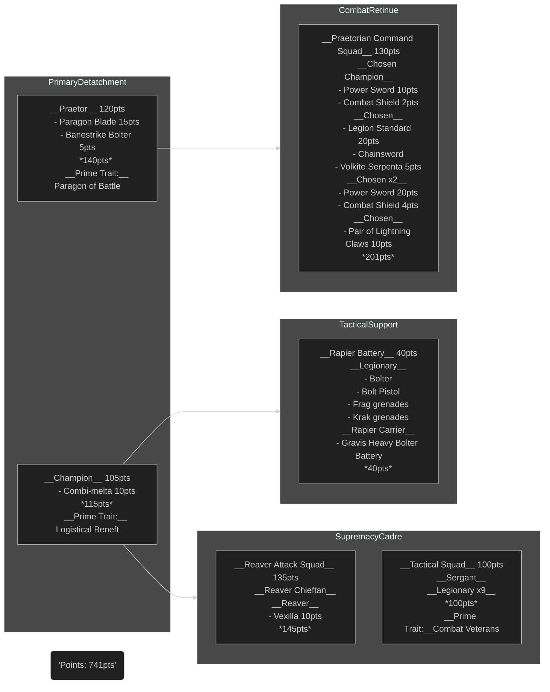

# The 13th Last

```mermaid
---
config:
  theme: 'dark'
---

flowchart LR

    markdown('Points: 741pts')

    HighCommand --> CombatRetinue
    Command --> TacticalSupport
    Command --> SupremacyCadre

    subgraph PrimaryDetatchment
    HighCommand[
        __Praetor__ 120pts
        - Paragon Blade 15pts
        - Banestrike Bolter 5pts
        *140pts* 
         __Prime Trait:__ Paragon of Battle
    ]
    Command[
        __Champion__ 105pts
        - Combi-melta 10pts
        *115pts*
        __Prime Trait:__ Logistical Beneft
    ]
    end

    subgraph CombatRetinue
    PraetorianCommandSquad[
        __Praetorian Command Squad__ 130pts
        __Chosen Champion__
        - Power Sword 10pts
        - Combat Shield 2pts
        __Chosen__
        - Legion Standard 20pts
        - Chainsword
        - Volkite Serpenta 5pts
        __Chosen x2__ 
        - Power Sword 20pts
        - Combat Shield 4pts
        __Chosen__
        - Pair of Lightning Claws 10pts
        *201pts*

    ] 
    end

    subgraph TacticalSupport
    RapierBattery[
        __Rapier Battery__ 40pts
        __Legionary__
        - Bolter
        - Bolt Pistol
        - Frag grenades
        - Krak grenades
        __Rapier Carrier__
        - Gravis Heavy Bolter Battery
        *40pts*
    ]
    end

    subgraph SupremacyCadre
    ReaverAttackSquad[
        __Reaver Attack Squad__ 135pts
        __Reaver Chieftan__
        __Reaver__
        - Vexilla 10pts
        *145pts*

    ]
    TacticalSquad[
        __Tactical Squad__ 100pts
        __Sergant__
        __Legionary x9__
        *100pts*
        __Prime Trait:__Combat Veterans
    ]
    end 
```